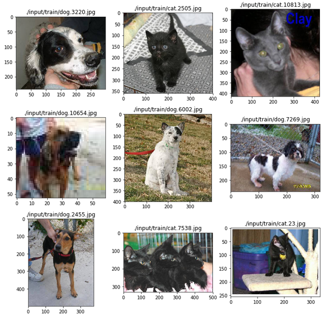

# 机器学习工程师纳米学位

## 毕业项目开题报告

张红亮 Udacity
2018年7月17日
## 猫狗大战

### 项目背景

猫狗分类问题是计算机视觉领域的经典问题，识别图片中的猫和狗对人类来说，2岁小孩即可轻松完成，但是让计算机完成这一任务，却是曾经机器学习技术难以攻克的一座大山，直到30年前，深度学习之父杰弗里·辛顿将多层神经网络带入机器学习领域，它为近10年来深度学习的发展奠定了基础，使得这个曾经困扰很多机器学习领域实践者多年的问题迎刃而解，近年来也涌现出非常多的用于图像识别的深度学习模型，计算机视觉成为人工智能研究的热门领域。

大数据竞赛平台Kaggle提供了一个供机器学习爱好者自我实践的竞赛项目[《Cats vs. Dogs》](https://www.kaggle.com/c/dogs-vs-cats-redux-kernels-edition)，在这个竞赛中，Kaggle提供了25000张猫和狗的图片作为训练数据集，提供了12500张猫和狗的图片作为测试集，本项目将基于此数据集完成。

### 问题描述

该项目需要解决的问题：输入一张彩色图片，输出狗的概率。

此问题是是一个监督学习的二分类问题，应用深度学习技术可以获得较好的识别准确率，在近10年来有很多相关的表现优秀的深度学习模型的诞生，特别是受生物视觉原理启发的[卷积神经网络CNN](https://en.wikipedia.org/wiki/Convolutional_neural_network)成为解决此类问题的首选模型，本项目也将采用CNN模型。

### 输入数据

用于模型训练和测试的数据集由[Kaggle](https://www.kaggle.com/c/dogs-vs-cats-redux-kernels-edition/data)提供，数据集下载后是一个压缩文件，解压后可以得到训练集和测试集文件夹。训练集文件夹中包含25000张猫狗彩色图片，其中猫和狗各12500张，文件以猫狗标签以及文件编号命名；测试集文件夹中包含打乱的12500张猫狗图片，猫和狗随机分布，文件以编号命名。模型训练的目标就是以较高的准确率给出测试集中每个图片是狗的概率。

经过仔细的观察，我发现训练集的数据有以下几个特点：
* 猫和狗的图像文件是按顺序排列的，前12500个文件是猫，后12500个文件是狗，因此在数据预处理时需要做乱序处理；
* 图像文件的宽高不一致，需要对图片做缩放处理，统一宽高；
* 有一些图像文件清晰度不够，光照条件不足，图像上的内容不光只有猫和狗，背景比较复杂，有一些是对猫和狗的日常进行的抓拍，猫和狗的脸都看不见，还有一些图片甚至根本没有猫和狗，这些都是异常数据，因此在训练模型时要防止过拟合。

### 解决办法

本项目的主要过程是利用训练数据集分批次对项目指导提供的一些知名的CNN模型进行训练，根据定义好的模型评价指标，做模型做评价验证，选出表现最佳的模型。基准模型理论上不能达到kaggle竞赛前10%的要求的，需要对模型进行适当调整使之更符合数据集特征，直到模型表现符合要求，然后用调参后的模型在测试数据集上测试。本项目将使用Keras完成，后端引擎使用TensorFlow，由于计算量较大，将使用亚马逊p3.2xlarge云服务器来完成。

### 基准模型

* **VGGNET**
  - VGGNET发布与2014年，作者是Karen Simonyan 和 Andrew Zisserman，该网络表明堆叠多个层是提升计算机视觉性能的关键因素；
  - VGGNET的特点是在各个卷积层利用3x3的小型卷积核以及2x2的最大池化层，通过反复堆叠串联的方式，来不断加深网络结构以提升性能，使用更小的卷积核进行反复堆叠串联的优势在于经过了更多次的非线性变换，对特征的学习能力更强[1]；
  - VGGNET共有5段卷积，每一段内有2-3个卷积层，每段卷积层尾部会连接一个最大池化层来缩小图片尺寸，网络深度为16-19层，VGGNET在训练时先训练级别A的简单网络，利用A网络的权重来初始化级别高的网络，加速收敛，在C网络中，增加了几个1x1的卷积层，主要意义在于线性变化，事实证明，效果显著[1]；
  - VGGNET具有很好的拓展性，在其它图片数据中具有很好的泛化能力，至今仍然被用来提取图像特征。

* **ResNet**
  - ResNet发布于2015年，由何凯明等人提出，它引入了残差网络很好的解决了深度神经网络在反向传播时的梯度消失问题，从此，神经网络在理论上可以无限深[2]。

* **Inception V3**
  - Inception V3发布于2015年，由Christian的团队提出，它关注的是怎样在不增加训练成本的前提下扩展神经网络，如果说ResNet是为了更深，那Inception就是为了更宽；
  - Inception V3引入了Inception模块进行降维，达到减少计算的目的，Inception模块将多个卷积层并行堆叠，从而得到深而宽的网络，在V3中将更大的卷积重构成了连续的更小的卷积，让学习变得更轻松，在V4中将残差连接放进每一个模组中，创造出了一种Inception-ResNet 混合网络结构[3]。

* **Xception**
  - Xception发布于2016年，由François Chollet提出，它的假设是跨通道的相关性和空间相关性是完全可分离的，最好不要联合映射它们，在传统的卷积网络中，卷积层会同时寻找跨空间和跨深度的相关性，Xception不同时寻找二者的相关性[4]；
  - Xception首先求一个2D空间的相关性，再通过后面跟一个跨通道的1x1卷积，求一个1D空间的相关性，这种映射学起来比全3D映射更加简单，事实证明，它的计算效率也更高，特别是在大规模数据上，表现突出[4]。

本项目的最低要求是kaggle竞赛[Dogs vs. Cats Redux: Kernels Edition](https://www.kaggle.com/c/dogs-vs-cats-redux-kernels-edition/leaderboard) public leaderboard前10%，目前该竞赛的参赛人数是1314，也就是最低需要达到131名，目前131名选手的得分是0.06127，因此本项目的logloss基准阈值是0.06127。

### 评估指标

根据kaggle竞赛的要求，本项目将采用对数损失函数来评价模型表现：

$$
\textrm{LogLoss} = - \frac{1}{n} \sum_{i=1}^n \left[ y_i \log(\hat{y}_i) + (1 - y_i) \log(1 - \hat{y}_i)\right],
$$
其中，

* $ n $ 为测试集中图片的数量；
* $ \hat {y}_i​$ 为预测图片内容为狗的概率；
* $ y_i $ 如果图片内容是狗，则为1，如果是猫，则为0；
* $ \log() $ 为自然（底为$e$）对数。

logloss值越小，模型的表现越好。

### 设计大纲

1. 数据预处理。利用kaggle API下载数据集，因为下载的是zip文件，需要用wget解压；正确读取训练数据后，对训练数据进行可视化，探索数据特征；由于训练集数据存在的尺寸和排序问题，预计要对训练集进行压缩、规则化、独热编码和乱序等处理；将训练数据按照一定比例划分为训练集、验证集和测试集，划分测试集的目的是为了测试模型的准确率。
2. 模型搭建。Keras预训练了几个基准模型，直接使用Keras加载模型，预计将搭建VGG16、ResNet50、InceptionV3、Xception四个基准模型。
3. 模型训练。利用划分好的训练集和验证集对四个基准模型进行依次训练，根据验证集logloss的表现选出最优的基准模型结构。
4. 模型调参。由于项目需要满足logloss基准阈值，当模型表现不能满足阈值要求时，需要对模型进行调参，主要调节图像尺寸、epochs、batch_size、Dropout层keep_prob、卷积层步长、池化层采样规则、激活函数等。
5. 模型评估。在模型的训练过程中，可视化展示每个迭代在训练集和验证集上的logloss值和accuracy值，根据这两个值来评估模型的表现，模型在验证集上的logloss值趋于平稳时停止训练，防止过拟合。在模型训练完成后，利用划分好的测试集对模型进行测试，查看模型在测试集上的logloss值和accuracy值。
6. 可视化。首先，在模型完成最终训练后，我会采用Ipython的SVG模块以及Keras的model_to_dot模块对最终模型结构做可视化展示；其次，我会使用matplotlib的pyplot模块对模型训练过程中训练集logloss和验证集logloss的变化做可视化展示；最后，在测试集上完成测试后，打印出在测试集上的logloss和accuracy，并利用pyplot随机展示几张图片以及预测的概率，以做验证。
7. 给出预测结果。利用最终模型预测测试集数据，生成每个图像的label，提交到kaggle。

### 参考文献
[1] Simonyan K, Zisserman A. Very Deep Convolutional Networks for Large-Scale Image Recognition[J]. Computer Science, 2014.
[2] He K, Zhang X, Ren S, et al. Deep Residual Learning for Image Recognition[J]. 2015:770-778.
[3] Szegedy C, Vanhoucke V, Ioffe S, et al. Rethinking the Inception Architecture for Computer Vision[J]. 2015:2818-2826.
[4] Chollet F. Xception: Deep Learning with Depthwise Separable Convolutions[J]. 2016:1800-1807.
