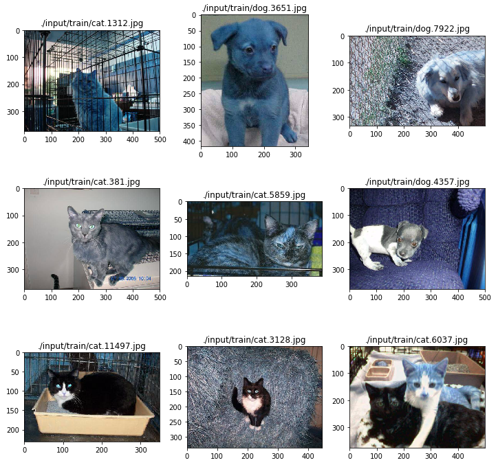
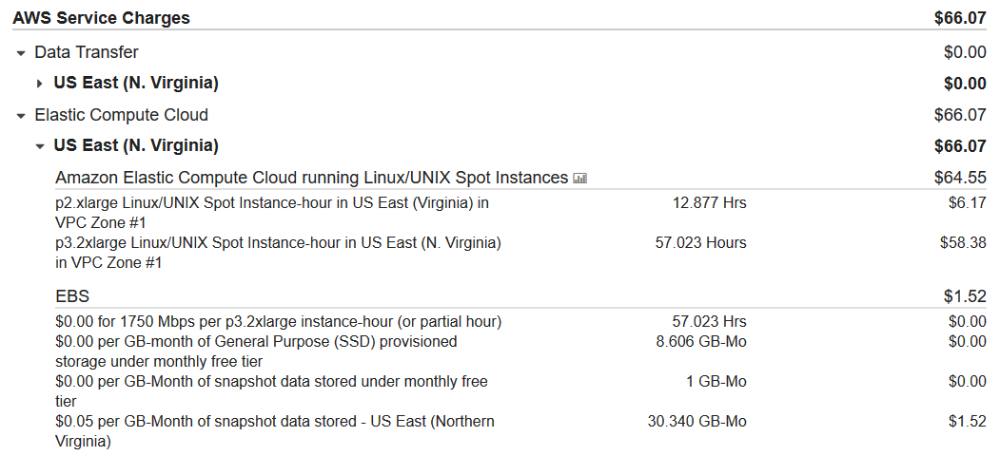

# 机器学习进阶毕业项目
##猫狗大战

本项目使用两个数据集，一个是kaggle猫狗大战竞赛官方数据集，包含2500张训练图片，其中猫和狗各12500张，以及12500张测试图片；一个是Oxford-IIIT上的数据，包含7393张图片，其中包含2400张猫的图片，4990张狗的图片，3张.mat文件。



项目使用数据下载地址：

kaggle竞赛数据：
```kaggle competitions download -c dogs-vs-cats-redux-kernels-edition```
The Oxford-IIIT Pet Dataset数据：
```http://www.robots.ox.ac.uk/%7Evgg/data/pets/data/images.tar.gz```


本项目主要在aws p3.2xlarge上完成，一共训练了两个模型。主要使用的库有`numpy`、`cv2`、`matplotlib`、`pandas`、`keras`、`csv`、`h5py`和`shutil`。机器系统为Ubuntu，GPU为NVIDIA Tesla V100。整个模型创建、调整和训练过程耗时70小时，其中p2.xlarge耗时13小时，p3.2xlarge耗时57小时。



**模型一：**使用`cv2`预处理图片，使用`NesNet50`作为单预训练模型，模型在训练集上的`loss`值为0.0328，准确率为0.9882，kaggle分数0.05719。模型使用aws p3.2xlarge训练，数据集和测试集的图片预处理时间大约10分钟，单个epoch上模型训练耗时104s；

**模型二：**使用keras的`ImageDataGenerator`对图片预处理，使用`model.predict_generator`导出预训练模型特征向量，使用`NesNet50`、`InceptionV3`和`Xception`三个预训练模型融合，模型在训练集上的loss值为0.0069，准确率为0.9955，kaggle分数为0.4017。模型使用aws p3.2xlarge训练，训练集和测试集的三个模型特征向量获取时间大约各4分钟，单个epoch上模型训练耗时不足1s。