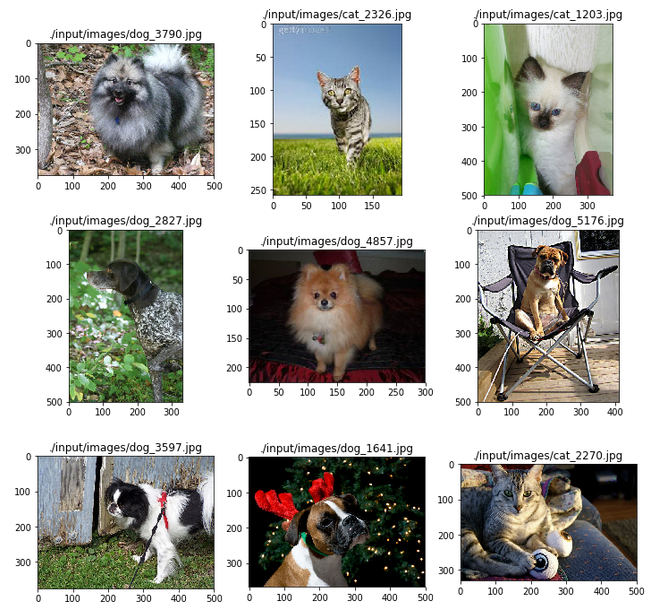

# 机器学习纳米学位
##毕业项目
张红亮 Udacity

2018年8月14日

## I. 问题的定义

### 项目概述

猫狗分类问题是计算机视觉领域的经典问题，识别图片中的猫和狗对人类来说，2岁小孩即可轻松完成，但是让计算机完成这一任务，却是曾经机器学习技术难以攻克的一座大山，直到30年前，深度学习之父杰弗里·辛顿将多层神经网络带入机器学习领域，它为近10年来深度学习的发展奠定了基础，使得这个曾经困扰很多机器学习领域实践者多年的问题迎刃而解，近年来也涌现出非常多的用于图像识别的深度学习模型，计算机视觉成为人工智能研究的热门领域。

大数据竞赛平台Kaggle提供了一个供机器学习爱好者自我实践的竞赛项目[《Cats vs. Dogs》](https://www.kaggle.com/c/dogs-vs-cats-redux-kernels-edition)，在这个竞赛中，Kaggle提供了25000张猫和狗的图片作为训练数据集，提供了12500张猫和狗的图片作为测试集。

同时，为了提高模型性能，本项目另外利用了 [The Oxford-IIIT Pet Dataset](http://www.robots.ox.ac.uk/%7Evgg/data/pets/) 7393张猫狗图片，这部分数据会作为训练集被使用。

本项目大部分模型训练的工作在AWS p3.2xlarge上完成，模型训练调整的过程共耗时70小时，其中使用p3.2xlarge 57小时，使用p2.xlarge 3小时。

整个项目的思路是利用keras的预训练模型，最开始使用`VGG16`，但是在验证集上logloss不变，尝试了调整激活函数、调整学习率、调整输出层激活函数，都不行，最后增加了`GlobalAveragePooling2D`层后，logloss才随着epoch下降，开始正常训练，但是模型的表现不好；然后尝试使用`ResNet50`，激活函数使用`PReLU`，使用全部数据训练，验证集上logloss为0.0493、准确率0.9828，kaggle分数0.12，未满足项目要求，然后调整激活函数为`ELU`，全连接层调整为256，优化器调整为`Nadam`，学习率调整为0.0005，模型在验证集上logloss下降为0.0368，准确率为0.9867，kaggle分数0.09334，未满足要求，之后尝试了各种调整，依然无法提高模型表现，然后想到补充训练集，于是使用The Oxford-IIIT Pet Dataset上7393张图上补充进训练集，模型在验证集上logloss下降为0.03286，准确率为0.9882，kaggle分数为0.07519，依然未满足要求，然后尝试使用`ImageDataGenerator`，依然不能提高模型表现；最后，尝试使用模型融合方法，在使用了ResNet50、InceptionV3和Xception三个模型融合后的模型，验证集上logloss下降为0.0069，准确率为0.9985，kaggle分数为0.0417，在学习使用模型融合方法的过程中，偶然学习到了`clip`方法，限制预测值在一个合理区间内，可以显著提高kaggle分数，因此我对之前单模型进行了clip，结果kaggle分数达到了0.05719，也满足项目要求。鉴于此，我在这个项目中同时保留了这两个模型。

### 问题陈述
该项目需要解决的问题：输入一张彩色图片，输出狗的概率。

此问题是是一个监督学习的二分类问题，应用深度学习技术可以获得较好的识别准确率，在近10年来有很多相关的表现优秀的深度学习模型的诞生，特别是受生物视觉原理启发的[卷积神经网络CNN](https://en.wikipedia.org/wiki/Convolutional_neural_network)成为解决此类问题的首选模型，本项目也将采用CNN模型。

### 评价指标
根据kaggle竞赛的要求，本项目将采用对数损失函数来评价模型表现：

$$
\textrm{LogLoss} = - \frac{1}{n} \sum_{i=1}^n \left[ y_i \log(\hat{y}_i) + (1 - y_i) \log(1 - \hat{y}_i)\right],
$$
其中，

* $ n $ 为测试集中图片的数量；
* $ \hat {y}_i​$ 为预测图片内容为狗的概率；
* $ y_i $ 如果图片内容是狗，则为1，如果是猫，则为0；
* $ \log() $ 为自然（底为$e$）对数。

logloss值越小，模型的表现越好。

## II. 分析

### 数据的探索
用于模型训练和测试的数据集由[Kaggle](https://www.kaggle.com/c/dogs-vs-cats-redux-kernels-edition/data)提供，数据集下载后是一个压缩文件，解压后可以得到训练集和测试集文件夹。训练集文件夹中包含25000张猫狗彩色图片，其中猫和狗各12500张，文件以猫狗标签以及文件编号命名；测试集文件夹中包含打乱的12500张猫狗图片，猫和狗随机分布，文件以编号命名。模型训练的目标就是以较高的准确率给出测试集中每个图片是狗的概率。

kaggle训练集图片示例：

补充训练集图片示例：

同时，为了提高模型性能，本项目另外利用了 [The Oxford-IIIT Pet Dataset](http://www.robots.ox.ac.uk/%7Evgg/data/pets/) 7393张猫狗图片，这部分数据会作为训练集被使用。

经过仔细的观察，我发现训练集的数据有以下几个特点：
* 猫和狗的图像文件是按顺序排列的，前12500个文件是猫，后12500个文件是狗，因此在数据预处理时需要做乱序处理；
* 图像文件的宽高不一致，需要对图片做缩放处理，统一宽高；
* 有一些图像文件清晰度不够，光照条件不足，图像上的内容不光只有猫和狗，背景比较复杂，有一些是对猫和狗的日常进行的抓拍，猫和狗的脸都看不见，还有一些图片甚至根本没有猫和狗，这些都是异常数据，因此在训练模型时要防止过拟合；
* 补充训练集数据文件不是以猫狗分类命名，需要进行猫和狗的分类。

### 探索性可视化
通过对kaggle训练集以及补充训练集的宽高可视化，发现训练集图片的大小不一致，kaggle训练集数据的宽高中位数为(447,374)，补充训练集数据的宽高中位数为(500,375)，因此在正式训练之前，需要对图片进行缩放处理。

kaggle训练集宽高分布直方图：

补充训练集宽高分布直方图：

### 算法和技术
本项目的思路是基于keras的预训练模型来构建模型，主要考虑的预训练模型有以下几种：

* **VGGNET**
  - VGGNET发布与2014年，作者是Karen Simonyan 和 Andrew Zisserman，该网络表明堆叠多个层是提升计算机视觉性能的关键因素；
  - VGGNET的特点是在各个卷积层利用3x3的小型卷积核以及2x2的最大池化层，通过反复堆叠串联的方式，来不断加深网络结构以提升性能，使用更小的卷积核进行反复堆叠串联的优势在于经过了更多次的非线性变换，对特征的学习能力更强[1]；
  - VGGNET共有5段卷积，每一段内有2-3个卷积层，每段卷积层尾部会连接一个最大池化层来缩小图片尺寸，网络深度为16-19层，VGGNET在训练时先训练级别A的简单网络，利用A网络的权重来初始化级别高的网络，加速收敛，在C网络中，增加了几个1x1的卷积层，主要意义在于线性变化，事实证明，效果显著[1]；
  - VGGNET具有很好的拓展性，在其它图片数据中具有很好的泛化能力，至今仍然被用来提取图像特征。

* **ResNet**
  - ResNet发布于2015年，由何凯明等人提出，它引入了残差网络很好的解决了深度神经网络在反向传播时的梯度消失问题，从此，神经网络在理论上可以无限深[2]。

* **Inception V3**
  - Inception V3发布于2015年，由Christian的团队提出，它关注的是怎样在不增加训练成本的前提下扩展神经网络，如果说ResNet是为了更深，那Inception就是为了更宽；
  - Inception V3引入了Inception模块进行降维，达到减少计算的目的，Inception模块将多个卷积层并行堆叠，从而得到深而宽的网络，在V3中将更大的卷积重构成了连续的更小的卷积，让学习变得更轻松，在V4中将残差连接放进每一个模组中，创造出了一种Inception-ResNet 混合网络结构[3]。

* **Xception**
  - Xception发布于2016年，由François Chollet提出，它的假设是跨通道的相关性和空间相关性是完全可分离的，最好不要联合映射它们，在传统的卷积网络中，卷积层会同时寻找跨空间和跨深度的相关性，Xception不同时寻找二者的相关性[4]；
  - Xception首先求一个2D空间的相关性，再通过后面跟一个跨通道的1x1卷积，求一个1D空间的相关性，这种映射学起来比全3D映射更加简单，事实证明，它的计算效率也更高，特别是在大规模数据上，表现突出[4]。

由于预处理数据的不同，需要对模型添加的分类器做一些改动，由于二分类问题的特性，分类器统一使用`sigmoid`，在添加全连接输出层时，如果是使用ImageDataGenerator做图片预处理，则输入层为预训练模型特征向量`X_train.shape[1:]`，输出层为`Dense(1)`，如果使用cv2做图片预处理，采用单模型训练，则输入层为预训练模型的输出层，输出层为`Dense(2)`。

### 基准模型
本项目的最低要求是kaggle竞赛[Dogs vs. Cats Redux: Kernels Edition](https://www.kaggle.com/c/dogs-vs-cats-redux-kernels-edition/leaderboard) public leaderboard前10%，目前该竞赛的参赛人数是1314，也就是最低需要达到131名，目前131名选手的得分是0.06127，因此本项目的logloss基准阈值是0.06127。

## III. 方法

### 数据预处理

#### 采用单模型的预处理过程

首先，删除kaggle训练集中的异常数据，异常数据包括图片中没有猫和狗、同时有猫和狗以及猫和狗的特征不明显，此部分数据一共49条。

然后，删除kaggle训练集中打错标签的两张图片。

之后，对补充训练集文件做重命名，文件根据细分分类分成猫和狗，以便获取文件便签。补充训练集中有3张图片是.mat文件，无法读取图像信息，故删除。找到补充数据集中无法用cv2读取的图片并删除，这部分图片一共有6张。

最后，对kaggle训练集和补充训练集做融合，利用`random.shuffle`做乱序处理，利用`cv2.imread`读取图片信息，利用`cv2.resize`做图片缩放处理，由于`cv2`读取的图像信息是(height, width, channels)，而keras预训练模型的输入要求是(width, height, channels)，因此使用transpose改变featues矩阵的形状，利用文件名对labels做独热编码。

做完这些预处理工作后，训练集中一共有32384张图片，在魔性训练时，利用`validation.split`把训练集分成训练集和验证集，验证集取整个训练集的20%数据，且通过设置`shuffle=True`，让模型在每个epoch开始前，对训练集做乱序处理。

测试集数据同样需要做预处理，不过不需要像训练集如此多的处理，只需要同一图像大小，与训练集保持一致。

在AWS p3.2xlarge上，整个数据预处理的过程大约需要10分钟的时间。

#### 采用融合模型的预处理过程

采用融合模型使用的是`ImageDataGenerator`做图片预处理，`ImageDataGenerator`要求训练集图片按分类存放在不同的文件夹下，因此首先需要做文件分类存放。

首先，需要创建文件存放的目录，利用`os.makedirs`创建训练集以及测试集文件存放的目录，主目录下一定要有分类目录，第三层才是图片数据。

然后，像单模型一样，删除异常图片、错误标记图片以及无法读取的文件，不同的是，这里需要从文件夹中删除文件。

最后，利用`ImageDataGenerator`做图片预处理，指定图片大小，对特殊模型做输入形状的处理。利用`predict_generator`生成预训练模型的特征向量。

在AWS p3.2xlarge上，整个数据预处理的过程大约需要10分钟的时间。

### 执行过程

整个项目的思路是利用keras的预训练模型，最开始使用`VGG16`，但是在验证集上logloss不变，尝试了调整激活函数、调整学习率、调整输出层激活函数，都不行，最后增加了`GlobalAveragePooling2D`层后，logloss才随着epoch下降，开始正常训练，但是模型的表现不好；

然后尝试使用`ResNet50`，激活函数使用`PReLU`，使用全部数据训练，验证集上logloss为0.0493、准确率0.9828，kaggle分数0.12，未满足项目要求，然后调整激活函数为`ELU`，全连接层调整为256，优化器调整为`Nadam`，学习率调整为0.0005，模型在验证集上logloss下降为0.0368，准确率为0.9867，kaggle分数0.09334，未满足要求，之后尝试了各种调整，依然无法提高模型表现；

之后想到补充训练集，于是使用The Oxford-IIIT Pet Dataset上7393张图上补充进训练集，模型在验证集上logloss下降为0.03286，准确率为0.9882，kaggle分数为0.07519，依然未满足要求，然后尝试使用`ImageDataGenerator`，依然不能提高模型表现；

最后，尝试使用模型融合方法，在使用了`ResNet50`、`InceptionV3`和`Xception`三个模型融合后的模型，验证集上logloss下降为0.0069，准确率为0.9985，kaggle分数为0.0417，在学习使用模型融合方法的过程中，偶然学习到了`clip`方法，限制预测值在一个合理区间内，可以显著提高kaggle分数，因此我对之前单模型进行了clip，结果kaggle分数达到了0.05719，也满足项目要求。

鉴于此，我在这个项目中同时保留了这两个模型。

### 完善
在最开始训练模型时，模型在验证集上的loss值不降反增，尝试了调整激活函数、调整学习率、调整输出层激活函数，都不行，最后通过增加`GlobalAveragePooling2D`层后，logloss才随着epoch下降，模型终于可以正常训练；

第一次提交kaggle，得分16.99608，检查之后发现测试集文件是乱序的，需要做文件名排序，排序后得分上升到0.35084；

训练过程中，验证了`sigmoid`分类器和`softmax`分类器的效果，`sigmoid`比`softmax`好；

图片大小调整到350*350后，模型性能不再提升；

把优化器从`SGD`调整到`Nadam`，激活函数从`Relu`调整到`ELU`，模型在验证集上loss和accuracy从(0.0493,0,9828)上升到(0.0368,0.9867)；

利用The Oxford-IIIT Pet Dataset补充训练集，模型在验证集上loss和accuracy从(0.0368,0.9867)上升到(0.0328,0.9882)；

在尝试了几次模型训练后，发现单纯使用`model.fit`无法获取最佳的模型，于是尝试使用`callback`回调函数，使用`ModelCheckpoint`保存最佳模型，使用`ReduceLROnPlateau`在训练过程中调整学习率，使用`EarlyStopping`防止过拟合，直接在训练过程中完成了学习率调整和最佳模型自动保存，kaggle分数一下从0.09334上升到0.07519；

使用`array.clip`把预测值限制在[0.005,0.995]之间，kaggle分数一下从0.07519上升到0.05719；

使用`ImageDataGenerator`预处理图片，使用`ResNet50`、`InceptionV3`和`Xception`生成图片特征向量做模型融合，kaggle分数从0.05719上升到0.04017。

## IV. 结果

### 模型的评价与验证

#### 单模型

模型在训练过程中，通过`layers.trainable=False`，来跳过预训练模型层的训练，保证模型在`ImageNet`上的训练权重不受影响，构建的模型通过在预训练模型的输出层后增加规范层、全连接层、`Dropout`层来提高模型表现，这部分的模型结构如下图所示：

模型训练过程loss和accuracy变化图：

最终模型在验证集上的loss值为0.0328，accuracy为0.9882，也就是一千张图片只错了12张，超过了人类的准确率，kaggle最终得分0.5719，超过了项目要求的基准值。

#### 融合模型

融合模型通过同时使用`ResNet50`、`InceptionV3`和`Xception`三个keras预训练模型提取训练集图像特征，然后直接添加`Dorpout`层和`sigmoid`分类器，模型结构如下图所示：

模型训练过程loss和accuracy变化图：

最终模型在验证集上的loss值为0.0069，accurac为0.9985，也就是一千张图片只错了2张，超过了人类的准确率，kaggle最终得分0.04017，排名第17名，超过了项目要求的基准值。

### 合理性分析
我的两个模型kaggle得分都超过了基准值，模型在验证集上的准确率都在98.8%以上，也就是对于1000张猫狗图片的输入，模型正确识别率在988张图片以上，这样的正确率是人类正常水平无法达到的，最终模型具备应用于实际生活的实践价值，比如用于宠物收养站做猫狗分类。

## V. 项目结论

### 结果可视化

模型结构可视化：

模型训练过程可视化：

模型预测结果可视化：

从预测结果可见，模型对于猫狗识别的准确率接近100%。

### 对项目的思考
1、本项目的数据预处理阶段，进行了异常值处理、训练集补充、图片缩放、乱序、标签独热编码等工作，同时也进行了`ImageDataGenerator`图片预处理工作；在模型构建阶段，进行了keras的几个预训练模型的探索工作，包括`VGG16`、`ResNet50`、`InceptionV3`和`Xception`的探索，最后选定了`ResNet50`作为单基础模型训练，在通过调整优化器、激活函数、分类器、学习率、`callback`回调函数等参数后，模型在验证集上最终达到了0.0328的loss值，kaggle分数达到了0.05719，满足项目要求；在模型测试阶段，由于文件是乱序的，因此需要先对文件做正序处理，再使用训练好的模型做预测，把预测值写入CSV文件，提交到kaggle。
2、通过keras的预训练模型，模型准确率轻轻松松可以达到90%以上，keras预训练模型真是图像识别的一把利器；
3、通过调整训练集图片尺寸，调整模型优化器、学习率、激活函数、保留率等参数，看见模型性能的上升，是一大乐趣所在；
4、项目过程中，碰到了以下几个困难：首先，在构建模型开始训练时，程序提示输入层的维度不匹配，通过查找资料才知道，原来是label的维度不对，把label的shape改成(25000,2)后，模型可以正常训练了；其次，在模型构建初期，模型在验证集上的loss不降反增，尝试各种方法无果后，有种想放弃的冲动，最后通过添加`GlobalAveragePooling2D`层后，logloss才随着epoch下降，模型终于可以正常训练；然后是第一次提交kaggle分数时，竟然达到了惊人的16以上，我当时就意识到肯定预测数据出了问题，通过一番查找后，才发现了是文件顺序不对，通过对文件重新排序后，分数降到了0.3以下；最后是模型融合，在我用单模型尝试了所有可能尝试的方法后，模型依然不能满足要求，自然就想到了模型融合，但是怎样做模型融合，再走了很多弯路后才找到正确的方法，即提取图片特征向量，通过这个方法，kaggle分数一下提到了0.04017。

### 需要作出的改进
1、`opencv`提供了很多对图片的增强方法，在数据预处理阶段，可以利用图片增强方法对训练集进行处理，获取更多更高质量的训练集数据；
2、`ImageDataGenerator`也提供了相关的图片处理属性，比如图片偏移、图片旋转等，由于图片处理需要耗费比较长的时间，故在此项目中未有使用，我相信使用了图片处理后，模型的表现可以更进一步；
3、使用模型融合，我选择了直接使用keras预训练模型提取图片特征，keras还有很多表现更好的模型可以尝试，或者对预训练模型进行一些微调(fine_tune)，使之更符合本项目数据特征，相信可以取得更好的模型表现；
4、在使用模型融合时，我尝试使用350*350尺寸的图片进行特征提取，在模型构建部分也做了一些改动，在验证集上模型的loss值达到了0.0033，准确率达到了0.9988，可是kaggle得分却不如在验证集上loss值为0.0069的模型，我觉得可能是logloss无穷大问题，于是尝试限制预测值在一个区间内，但是始终无法超过0.0069的分数，如果能解决这个问题，kaggle排名有望冲进前十。

## 参考文献
[1] Simonyan K, Zisserman A. Very Deep Convolutional Networks for Large-Scale Image Recognition[J]. Computer Science, 2014.

[2] He K, Zhang X, Ren S, et al. Deep Residual Learning for Image Recognition[J]. 2015:770-778.

[3] Szegedy C, Vanhoucke V, Ioffe S, et al. Rethinking the Inception Architecture for Computer Vision[J]. 2015:2818-2826.

[4] Chollet F. Xception: Deep Learning with Depthwise Separable Convolutions[J]. 2016:1800-1807.